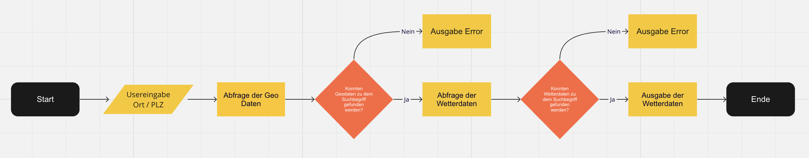

# WeatherApp

Willkommen bei der WeatherApp! Der einfachsten Webanwendung wenn es darum geht, das Wetter für einen bestimmten Ort zu überprüfen.

## Verwendung

1. Gib den gewünschten Ort (Stadtname oder Postleitzahl) im Eingabefeld ein.

## Funktionen/Features

- Anzeige aktueller Wetterinformationen für einen bestimmten Ort.
- Vorhersage von Wetterinformationen für die folgenden 5 Tage.

## Screenshots

## Link zur Demo

## Tools/Technologien

- HTML
- CSS / sCSS
- JavaScript
- Openweathermap API

## Für welche Bildschirmgrößen?

Die WeatherApp ist für verschiedene Bildschirmgrößen optimiert und reagiert auf mobile Geräte sowie Desktop-Ansichten.

## Flowchart

## Mitwirkende

- [Runhong](https://github.com/huangrunhong)
- [Samuel](https://github.com/samuelaliyari)
- [Konstantin](https://github.com/KWiefel)

## Credits

Mit Liebe von Runhong, Samuel & Konstantin gemacht.

---
